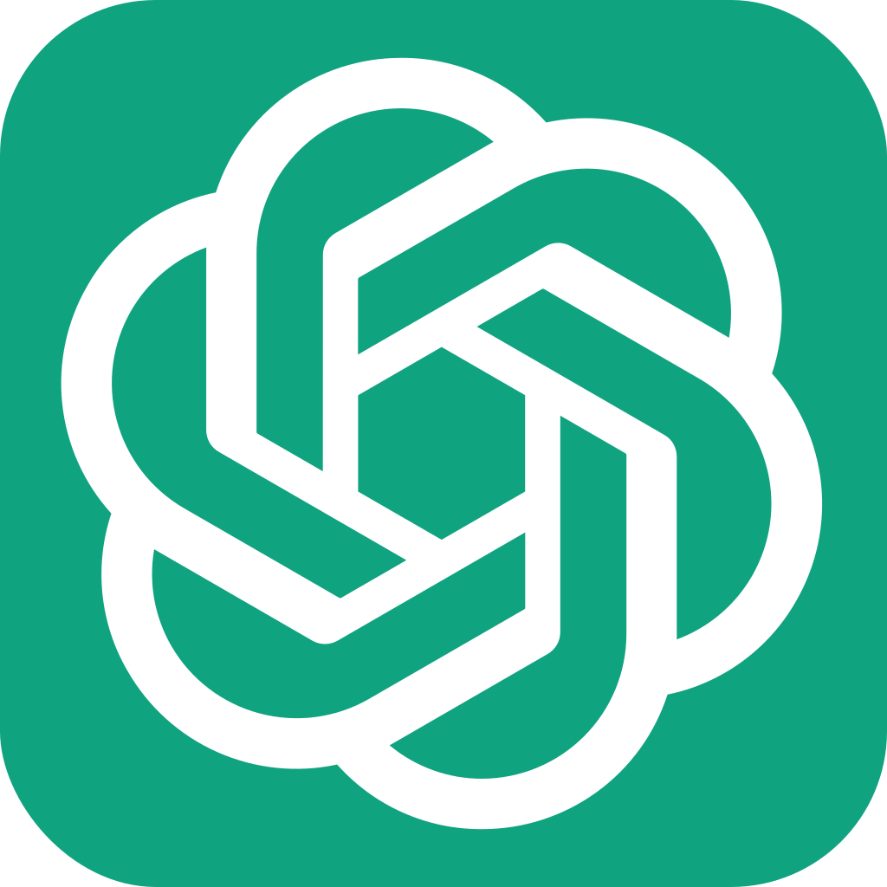

# ChatGPT-iOS

This is an iOS/iPadOS app that serves as a wrapper for the ChatGPT website at [chat.openai.com](https://chat.openai.com/). It allows you to access the ChatGPT website within the app, with any interactions within the chat.openai.com domain opening in the app's `WKWebView`. URLs loaded that aren't in the chat.openai.com domain will open in Safari.

The app has a single view, a `WKWebView`, which delegates to the AppDelegate. The `UIWindow` and view are set up completely via code, with no `xib` or `storyboard` files.

The code for this app was written by ChatGPT.

You can view the chat transcript at [transcript/transcript.html](https://capnslipp.github.io/ChatGPT-iOS/transcript/transcript.html).

Sincerely,

ChatGPT
